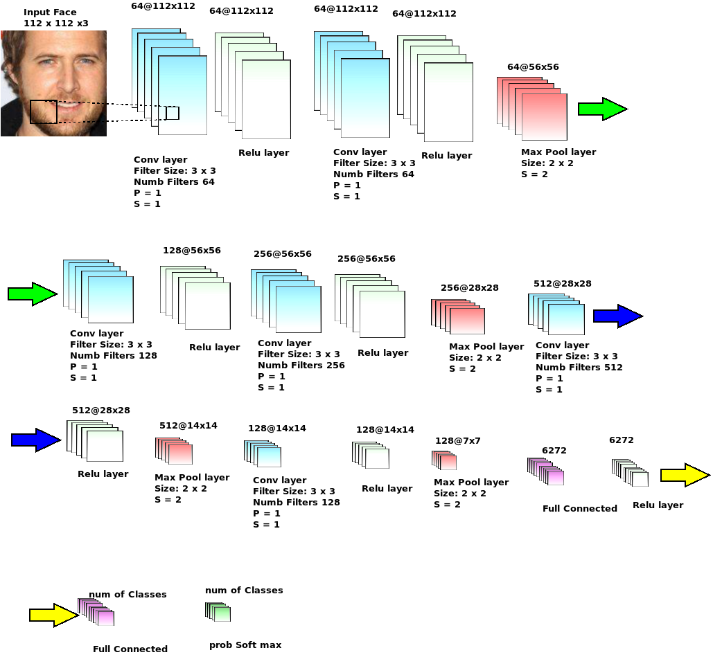

# Tensorflow: From Building of  Database to Training and Prediction of Deep Convolutional Neural Network 

This is a very Simple example of showing how to build image dataset from your own collection of images, how to  train  multiple class classifier using tensorflow CNN and how to predict the class of an object in an unseen image.

This code is designed so that a newbie user become able to train a tensorflow CNN model using his limited CPU resources. By loading small batches of images in the HDF5 data format is the key for doing so.

We took an example of face recognition. The small VGG FACE network is shown in the Figure  

## Step 1 :
 Build  HDF5 database from your own images using the following Command. You can set a few simple input parameters in a vggfaces.json file such as input image size, number images in a miniBatch
 
	 python buildDatabase.py
	 
### note:  
Before building your  own training hdf5 dataset,  you must put training images using the following directory structure 

.
├──  rootFolder

	└── ClassA
		└── image1.png
		└── image2.png
		└──
		└──
		└── imagen.png
	   |
	   
	   └── ClassB
		└── image1.png
		└── image2.png
		└──
		└──
		└── imagen.png
	     |
	     |
	     |
	     |
	     
	     └── ClassN
		└── image1.png
		└── image2.png
		└──
		└──
		└── imagen.png
	  
	
 
## Step 2: Train a tensorflow CNN

Train your model executing the following command
	python trainTesnorCNN.py
	
	
## Step 3: Predicting a class of unkown image
Using the trained model, you can predict eg the identity of a face in an unseen image
 
	 python predict_TensorFlowCNN.py
	 
	 
	 
# Creating your own CNN Archicture

you can define your own CNN by adding your own method to the class ConvNNTF define in multiClassCNN/ConvNN.py file.
 
 
